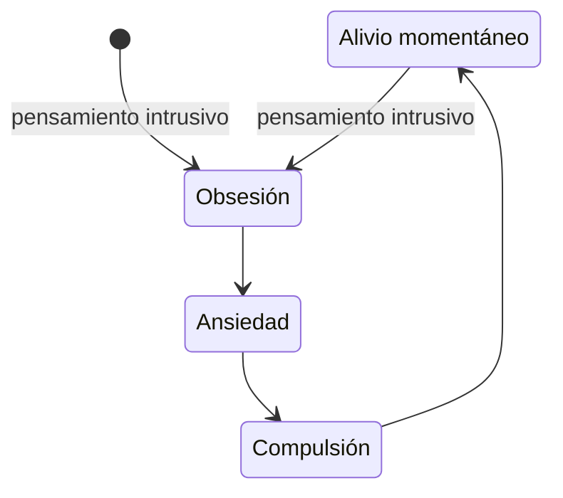

### Introducción
El  es un trastorno mental caracterizado por las **obsesiones** y las **compulsiones**, el gran malestar que estas generan y la frecuencia con las que se sufren.

Está considerado por la OMS como uno de los cinco trastornos mentales más inhabilitantes. Sin embargo, sigue siendo un gran desconocido para la mayoría de nosotros. Hasta hace poco tiempo, el TOC se consideraba dentro de los trastornos de ansiedad. Actualmente se le considera en una categoría independiente.

{{< figure src="https://ysm-res.cloudinary.com/image/upload/c_crop,x_0,y_172,w_2231,h_1255/c_fill,f_auto,q_auto:eco,dpr_1,w_753,ar_16:9/v1/yms/prod/5d63e66c-deeb-4577-8bc6-7779a0b730ac"
alt="Comparativa de un cerebro de un paciente con TOC con uno sin TOC"
link="https://medicine.yale.edu/news-article/what-does-an-ocd-brain-look-like/"
caption="Imágenes obtenidas mediante PET del cerebro de una persona sin TOC (arriba) y del de una persona con TOC (abajo) mostrando las diferencias en la activación de las distintas zonas (rojo-amarillo mayor activación). Yale School of Medicine." >}}

### Las obsesiones
Las obsesiones son pensamientos **intrusivos** (ideas, imágenes, impulsos, sensaciones), recurrentes y persistentes que provocan: gran malestar (miedo, asco, inquietud…), ya que son contrarios a los valores de la persona que los sufre (son   **egodistónicos**); **ansiedad**; y gran sufrimiento.

La cantidad de pensamientos intrusivos que sufre una persona con TOC puede ser absolutamente abrumadora.

### Las compulsiones
Las compulsiones son las conductas repetitivas, tanto físicas como mentales, que el afectado lleva a cabo para intentar rebajar su nivel de ansiedad, contrarrestar los pensamiento intrusivos o prevenir un suceso temido.

### Causas
El TOC es un trastorno mental del que no se conoce una causa concreta. Se considera de origen multifactorial, es decir, que pueden intervenir muchos factores simultáneamente para que una persona lo desarrolle:
* factores genéticos: antecedentes familiares
* rasgos de personalidad concretos (variables cognitivas):
  * intolerancia a la incertidumbre
  * gran sensibilidad
  * gran sentido de la responsabilidad
  * baja tolerancia a la frustación y perfeccionismo
  * rigidez de ideas
  * sobreestimación de las amenazas: magnificar la probabilidad de que algo malo vaya a ocurrir
* madres y padres demasiado estrictos o demasiado sobreproctectores
* causas bioquímicas y neurobiológicas: anomalías en ciertos neurotransmisores 
* sucesos estresantes que pueden actuar como detonantes
* otros trastornos mentales (comorbilidad)
* infección por estreptococos (PANDAS, *Pediatric Autoimmune Neuropsychiatric Disorders Associated with Streptococcal infections*)
    

### El ciclo del TOC

### Gravedad del TOC
Los psicólogos y psiquiatras valoran la severidad o gravedad del TOC antes de comenzar la terapia y el tratamiento. Para ello se tienen en cuenta: la cantidad de obsesiones, la intensidad del malestar, el nivel de ansiedad, las horas diarias que la persona dedica a distintas compulsiones, etc. Se utilizan herramientas en forma de encuesta como la conocida por la escala Y-BOCS (*Yale-Brown Obssesive-Compulsive Scale*) y su versión para menores CY-BOCS. Ambas evalúan las compulsiones y las obsesiones y las puntúan, valorando la severidad en muy leve, leve, moderado o severo.

### Prevalencia
Las cifras varían con los estudios. Por ejemplo, un reciente estudio llevado a cabo en 10 países sobre una población de más de 50.000 personas arrojó las siguientes cifras: la prevalencia de por vida se estimó en el 4,1%, es decir, 4 de cada 100 personas encuestadas habían sufrido TOC en algún momento de su vida y 3 de cada 100 lo habían tenido durante el último año.

Otros 
 llegando al 3.5% en Asia. Por tanto en España hay alrededor de un millón de personas afectadas. 

### Autoestima e inseguridad
Dos de los rasgos de los afectados por TOC son una baja autoestima y mucha inseguridad.
Esto se debe a que, sobre todo a partir de adolescencia, son absolutamente conscientes de lo absurdo de las obsesiones y compulsiones. Además saben que no son alucionaciones, como en otros trastornos mentales.

### Tratamiento psiquiátrico
En estas dos charlas la eminente [Dra. Pino Alonso](/personas/#dra-mar%c3%ada-del-pino-alonso) explica todos los posibles tratamientos del TOC desde del punto de vista psiquiátrico,tanto farmacológicos como estimulación 
  
* Tratamientos farmacológicos del TOC:
  
  
* Tratamientos para pacientes resistentes a los fármacos y a la terapia:
  
  
* [Carles Soriano-Mas](/personas/#carles-soriano-mas), neuropsicólogo clínico, explica Asi el TOC es un problema biológico o aprendido:
  

