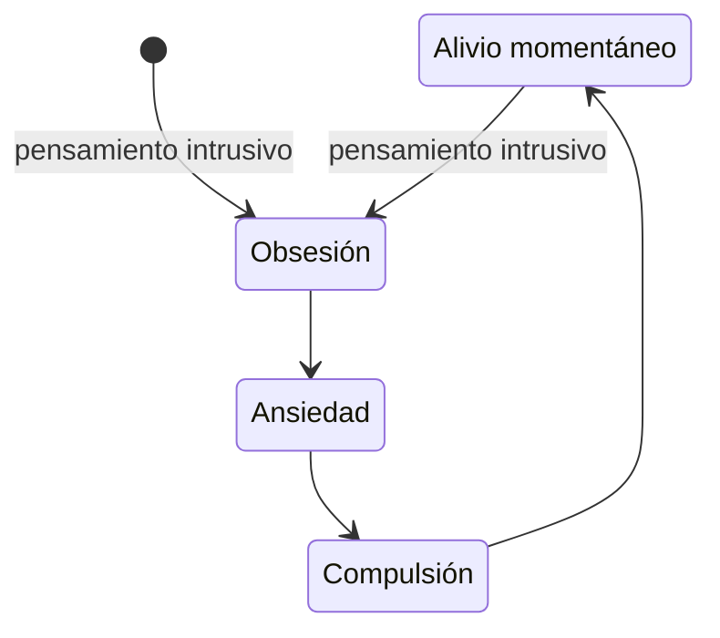

### Introducción

El TOC es un trastorno mental caracterizado por **obsesiones** que causan un gran malestar emocional y, muy habitualmente, **compulsiones** que se realizan para tratar de aliviar este malestar o prevenir un suceso temido y que, a largo plazo, refuerzan el trastorno.

Aunque está considerado por la  como uno de los trastornos mentales más inhabilitantes, sigue siendo un gran desconocido para la mayoría de nosotros. Hasta hace unos años, el TOC se consideraba dentro de los trastornos de ansiedad. Actualmente se considera una categoría independiente junto al trastorno dismórfico corporal, trastorno de acumulación, trastorno por conductar repetitivas centradas en el cuerpo, manía depilatoria o tricotilomanía, dermatilomanía y trastorno de referencia olfativa.



### Las obsesiones

Las obsesiones son pensamientos **intrusivos** (dudas, ideas, imágenes, impulsos, sensaciones), repetitivos, persistentes y no deseados que provocan: gran malestar (miedo, asco, culpa, inquietud…), ya que son contrarios a los valores de la persona que los sufre (son **egodistónicos**); en muchos casos, **ansiedad**; y, en general, gran sufrimiento.

A menudo, implican preocupación o el miedo de la persona a sufrir un daño o a que sus seres queridos lo sufran, ya que interpreta el pensamiento como peligroso y sobreestima su importancia. 

Estudios y revisiones indican que los pensamientos intrusivos son muy comunes en la población general. Se empieza a considerar un problema cuando:
* se dedica más de una hora al día a pensarlos o a realizar conductas para neutralizarlos;
* causan un malestar significativo que en el día a día de la persona. 

### Las compulsiones

Las compulsiones son las conductas repetitivas, tanto físicas como mentales, que el afectado lleva a cabo para intentar rebajar su nivel de ansiedad, contrarrestar los pensamiento intrusivos o prevenir un suceso temido.

### Causas

Las últimas investigaciones apuntan cada vez más a que el TOC es un trastorno neurobiológico que afecta a circuitos cerebrales específicos y que suele surgir por una combinación de predisposición genética y factores desencadenates diversos, por ejemplo:

* factores genéticos (antecedentes familiares)
* ambientes familiares muy estrictos o demasiado sobreproctectores
* sucesos estresantes o traumáticos que pueden actuar como detonantes
* otros trastornos mentales (comorbilidad)
* infección por estreptococos que afecta al [núcleo caudado](https://es.wikipedia.org/wiki/N%C3%BAcleo_caudado) del cerebro (PANDAS, *Pediatric Autoimmune Neuropsychiatric Disorders Associated with Streptococcal infections*)

### Rasgos de personalidad

Las personas con TOC suelen compartir algunos rasgos de personalidad comunes, que puden facilitar el desarrolo del TOC y que el propio trastorno puede reforzar. Además, algunas de ellas están bastante interrelacionadas. Por ejemplo:

* inteligencia por encima de la media
* intolerancia a la incertidumbre
* gran sensibilidad
* gran sentido de la responsabilidad
* baja tolerancia a la frustación
* perfeccionismo
* rigidez de ideas
* sobreestimación de las amenazas
* introversión
* tendencia a interiorizar
* necesidad de control

Una vez que el TOC se ha desarrollado, a causa del aluvión de dudas que les proporciona su cerebro, los afectados por TOC suelen desarrollen gran inseguridad y baja autoestima. 

Aunque el TOC no es un trastorno de la personalidad, suele tener una alta comorbilidad con el trastorno de personalidad obsesivo-compulsivo (TPOC), que también se caracteriza por rigidez de ideas, perfeccionismo extremo, etc. 

### El ciclo del TOC

### Gravedad del TOC

Los psicólogos y psiquiatras valoran la severidad o gravedad del TOC antes de comenzar la terapia y el tratamiento. Para ello se tienen en cuenta: la cantidad de obsesiones, la intensidad del malestar, el nivel de ansiedad, las horas diarias que la persona dedica a las distintas compulsiones, etc. Se utilizan herramientas en forma de encuesta como la conocida por la escala Y-BOCS (*Yale-Brown Obssesive-Compulsive Scale*) y su versión para menores CY-BOCS. Ambas evalúan las compulsiones y las obsesiones y las puntúan, valorando la severidad en muy leve, leve, moderado o severo.

### Prevalencia

Las cifras varían con los estudios. Por ejemplo, un reciente estudio llevado a cabo en 10 países sobre una población de más de 50.000 personas arrojó las siguientes cifras: la prevalencia de por vida se estimó en el 4,1%, es decir, 4 de cada 100 personas encuestadas habían sufrido TOC en algún momento de su vida y 3 de cada 100 lo habían tenido durante el último año.

Otros 
 llegando al 3.5% en Asia. Por tanto en España hay alrededor de un millón de personas afectadas. 

### Autoestima e inseguridad
Dos de los rasgos de los afectados por TOC son una baja autoestima y mucha inseguridad.
Esto se debe a que, sobre todo a partir de adolescencia, son absolutamente conscientes de lo absurdo de las obsesiones y compulsiones. Además saben que no son alucionaciones, como en otros trastornos mentales.

### Tratamiento psiquiátrico
En estas dos charlas la eminente [Dra. Pino Alonso](/personas/#dra-mar%c3%ada-del-pino-alonso) explica todos los posibles tratamientos del TOC desde del punto de vista psiquiátrico,tanto farmacológicos como estimulación 
  
* Tratamientos farmacológicos del TOC:
  
  
* Tratamientos para pacientes resistentes a los fármacos y a la terapia:
  
  
* [Carles Soriano-Mas](/personas/#carles-soriano-mas), neuropsicólogo clínico, explica Asi el TOC es un problema biológico o aprendido:
  

